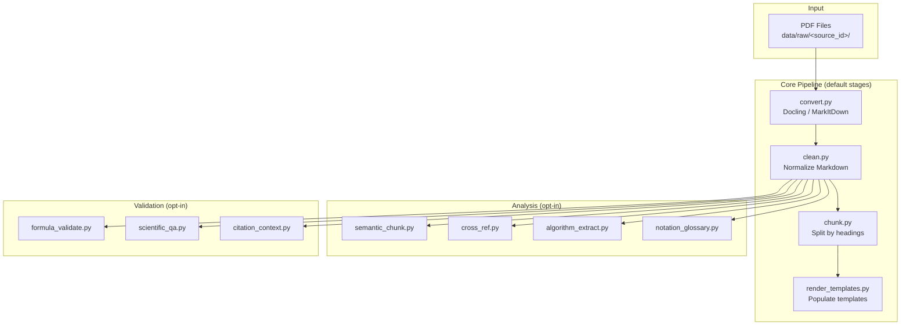

# Architecture Overview

## Data Flow



## Key Output Contracts

- Core outputs (default):
  - `outputs/raw_md/<source_id>/`
  - `outputs/cleaned_md/<source_id>/`
  - `outputs/chunks/<source_id>/`
- Analysis outputs:
  - `outputs/semantic_chunks/`
  - `outputs/quality/*.json`
- With `--session-name`:
  - `outputs/raw_md/<session>/<source_id>/...`
  - `outputs/cleaned_md/<session>/<source_id>/...`
  - `outputs/chunks/<session>/<source_id>/...`
  - `outputs/quality/<session>/*.json`

## Directory Layout

```text
cortexmark/
├── common.py              # Shared: config, logging, manifest, path helpers
├── run_pipeline.py        # Orchestrator — runs stages in order
├── convert.py             # Stage 1: PDF → raw Markdown
├── clean.py               # Stage 2: Normalize Markdown
├── chunk.py               # Stage 3: Split into sections
├── render_templates.py    # Stage 4: Generic template population
├── semantic_chunk.py      # Analyze: Semantic segmentation
├── cross_ref.py           # Analyze: Cross-reference resolution
├── algorithm_extract.py   # Analyze: Pseudocode extraction
├── notation_glossary.py   # Analyze: Notation extraction
├── formula_validate.py    # Validate: Formula checks
├── scientific_qa.py       # Validate: Scientific QA checks
├── citation_context.py    # Validate: Citation-context analysis
└── plugin.py              # Plugin discovery + context-hook contracts
```
