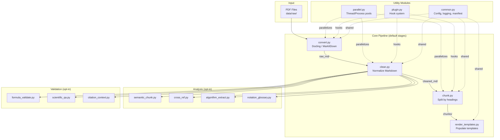
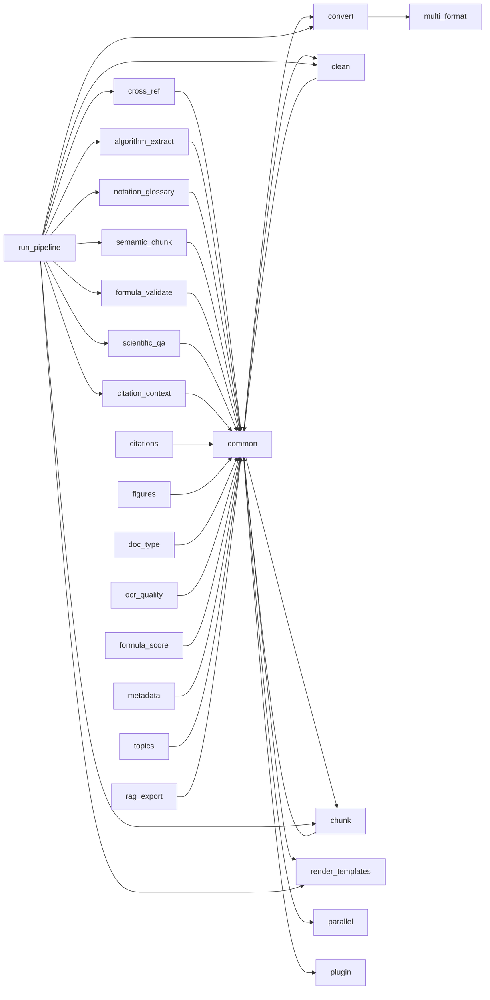

# Architecture Overview

## Data Flow



## Module Dependency Graph



## Directory Layout

```
phinitelab_pdf_pipeline/
├── common.py              # Shared: config, logging, manifest, paths
├── run_pipeline.py        # Orchestrator — runs stages in order
│
├── convert.py             # Stage 1: PDF → raw Markdown
├── multi_format.py        #   Dual-engine merge logic
├── clean.py               # Stage 2: Normalize Markdown
├── chunk.py               # Stage 3: Split into sections
├── render_templates.py    # Stage 4: Template population
│
├── semantic_chunk.py      # Analyze: ML-based semantic segmentation
├── cross_ref.py           # Analyze: Cross-reference resolution
├── algorithm_extract.py   # Analyze: Pseudocode detection
├── notation_glossary.py   # Analyze: Math notation catalog
│
├── formula_validate.py    # Validate: LaTeX formula checking
├── scientific_qa.py       # Validate: Scientific quality assurance
├── citation_context.py    # Validate: Citation purpose classification
│
├── citations.py           # Utility: Citation graph analysis
├── figures.py             # Utility: Figure reference extraction
├── doc_type.py            # Utility: Document type detection
├── ocr_quality.py         # Utility: OCR confidence scoring
├── formula_score.py       # Utility: Formula fidelity scoring
├── metadata.py            # Utility: Document metadata extraction
├── topics.py              # Utility: Topic classification
├── rag_export.py          # Utility: RAG-ready JSON/JSONL export
├── diff.py                # Utility: Markdown diff comparison
├── ghpages.py             # Utility: GitHub Pages site generation
├── qa_pipeline.py         # Utility: QA report aggregation
│
├── parallel.py            # Infra: Thread/process pool parallelism
├── plugin.py              # Infra: Plugin discovery and hooks
└── py.typed               # PEP 561 type marker
```

## Key Design Decisions

1. **No LLM dependency** — all analysis is rule-based and deterministic
2. **Idempotent by default** — manifest tracks processed files, skips on re-run
3. **Plugin hooks** — 7 hook points let users extend without modifying core code
4. **Dual-engine merge** — runs both Docling and MarkItDown, picks best output per section
5. **Dataclass contracts** — all inter-module data uses frozen/typed dataclasses
