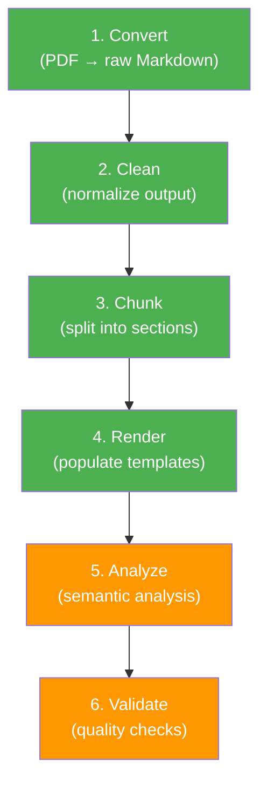

# Pipeline Stages

The pipeline runs six stages in order. The first four run by default;
`analyze` and `validate` are opt-in.

## Stage 1: Convert

**Module:** `phinitelab_pdf_pipeline.convert`

Converts PDF files to raw Markdown using one of three engines:

| Engine | Description | Accuracy | Speed |
|--------|-------------|----------|-------|
| `docling` | Deep layout analysis with ML models | High | Slow |
| `markitdown` | Lightweight, CPU-only extraction | Medium | Fast |
| `dual` | Runs both engines, merges results | Highest | Slowest |

**Input:** PDF files under `data/raw/`
**Output:** Raw Markdown in `outputs/raw_md/`

## Stage 2: Clean

**Module:** `phinitelab_pdf_pipeline.clean`

Normalizes raw Markdown output:

- Removes duplicate headers/footers
- Normalizes whitespace and blank lines
- Fixes broken table formatting
- Recovers formula placeholders
- Strips page numbers and artifacts

**Input:** `outputs/raw_md/`
**Output:** `outputs/cleaned_md/`

## Stage 3: Chunk

**Module:** `phinitelab_pdf_pipeline.chunk`

Splits cleaned Markdown into logical sections by heading level.

- Configurable split levels (default: H1, H2)
- Preserves document hierarchy
- Generates one file per chunk

**Input:** `outputs/cleaned_md/`
**Output:** `outputs/chunks/`

## Stage 4: Render

**Module:** `phinitelab_pdf_pipeline.render_templates`

Populates Markdown templates for course-structured content.

## Stage 5: Analyze (optional)

Run with `--stages analyze`. Includes four sub-stages:

| Sub-stage | Module | Output |
|-----------|--------|--------|
| Semantic Chunk | `semantic_chunk` | `outputs/semantic_chunks/` |
| Cross-Reference | `cross_ref` | `outputs/quality/crossref_report.json` |
| Algorithm Extract | `algorithm_extract` | `outputs/quality/algorithm_report.json` |
| Notation Glossary | `notation_glossary` | `outputs/quality/notation_report.json` |

## Stage 6: Validate (optional)

Run with `--stages validate`. Includes three sub-stages:

| Sub-stage | Module | Output |
|-----------|--------|--------|
| Formula Validation | `formula_validate` | `outputs/quality/formula_validation.json` |
| Scientific QA | `scientific_qa` | `outputs/quality/scientific_qa.json` |
| Citation Context | `citation_context` | `outputs/quality/citation_context.json` |

## All 16 Analysis Modules

| Module | Purpose |
|--------|---------|
| `convert` | PDF → Markdown conversion |
| `clean` | Markdown normalization |
| `chunk` | Section splitting |
| `render_templates` | Template population |
| `semantic_chunk` | ML-based semantic segmentation |
| `cross_ref` | Cross-reference resolution |
| `algorithm_extract` | Pseudocode algorithm detection |
| `notation_glossary` | Mathematical notation cataloging |
| `formula_validate` | LaTeX formula verification |
| `formula_score` | Formula fidelity scoring |
| `scientific_qa` | Scientific document QA checks |
| `citation_context` | Citation purpose classification |
| `citations` | Citation graph analysis |
| `figures` | Figure reference extraction |
| `doc_type` | Document type classification |
| `ocr_quality` | OCR confidence assessment |
