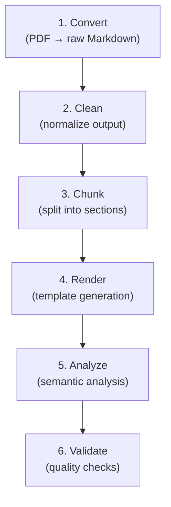

# Pipeline Stages

The pipeline runs six stages in order. The first four run by default;
`analyze` and `validate` are opt-in.

## Stage 1: Convert

- **Module:** `cortexmark.convert`
- **Input (default):** `data/raw/<source_id>/`
- **Output:** `outputs/raw_md/<source_id>/`

## Stage 2: Clean

- **Module:** `cortexmark.clean`
- **Input (default):** `outputs/raw_md/<source_id>/`
- **Output:** `outputs/cleaned_md/<source_id>/`

## Stage 3: Chunk

- **Module:** `cortexmark.chunk`
- **Input (default):** `outputs/cleaned_md/<source_id>/`
- **Output:** `outputs/chunks/<source_id>/`

## Stage 4: Render

- **Module:** `cortexmark.render_templates`
- Uses configurable outline discovery (`render_templates.outline_file`) and
  gracefully falls back to folder/content-based generation if no outline file exists.

## Stage 5: Analyze (optional)

Run with `--stages analyze`.

| Sub-stage | Module | Output |
|-----------|--------|--------|
| Semantic Chunk | `semantic_chunk` | `outputs/semantic_chunks/` |
| Cross-Reference | `cross_ref` | `outputs/quality/crossref_report.json` |
| Algorithm Extract | `algorithm_extract` | `outputs/quality/algorithm_report.json` |
| Notation Glossary | `notation_glossary` | `outputs/quality/notation_report.json` |

## Stage 6: Validate (optional)

Run with `--stages validate`.

| Sub-stage | Module | Output |
|-----------|--------|--------|
| Formula Validation | `formula_validate` | `outputs/quality/formula_validation.json` |
| Scientific QA | `scientific_qa` | `outputs/quality/scientific_qa.json` |
| Citation Context | `citation_context` | `outputs/quality/citation_context.json` |

When you pass `--session-name`, PDFs are staged under `sessions/<session-name>/data/raw/` and quality outputs are written under
`sessions/<session-name>/outputs/quality/`.
