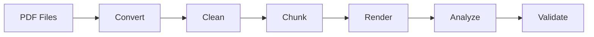

# CortexMark

A multi-stage pipeline that converts PDF documents into structured Markdown,
cleans the output, and splits it into logical chunks for downstream NLP tasks.

## Key Features

- **Dual-engine conversion** — Docling (deep layout analysis) and MarkItDown (lightweight CPU-only)
- **16 analysis modules** — formula validation, citation context, scientific QA, cross-references, and more
- **Plugin architecture** — extend the pipeline with custom pre/post hooks
- **VS Code extension** — sessions, preview panel, dashboard, and chat interface
- **Docker support** — reproducible builds with GPU passthrough

## Quick Links

| Resource | Link |
|----------|------|
| Installation | [Getting Started](getting-started/installation.md) |
| CLI Usage | [Quick Start](getting-started/quickstart.md) |
| Pipeline Stages | [User Guide](guide/pipeline-stages.md) |
| Architecture | [Overview](architecture/overview.md) |
| API Reference | [Modules](api/modules.md) |
| Contributing | [Guide](contributing.md) |

## Pipeline at a Glance

## Quality Badges

