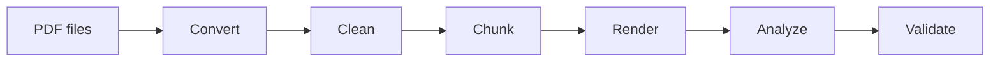

# CortexMark

CortexMark is a structured, layout-aware **PDF → Markdown** pipeline for academic documents, books, reports, and RAG-ready datasets.

It is designed for people who want a local, reproducible pipeline that can:

- convert PDFs into structured Markdown,
- clean and normalize noisy extraction output,
- split documents into chunks,
- run scholarly analysis such as citations, cross-references, notation, and theorem/proof-aware checks,
- export machine-friendly artifacts for search, QA, and downstream pipelines.

## Start here

If you are new to the project, use this order:

1. **[Installation](getting-started/installation.md)** — choose the right install path
2. **[Quick Start](getting-started/quickstart.md)** — run the pipeline on your first PDFs
3. **[Requirements, Inputs, and Outputs](guide/inputs-and-outputs.md)** — understand what gets installed, processed, and produced
4. **[VS Code Setup](vscode/setup.md)** — optional GUI/session workflow

## What CortexMark does well

- **Dual-engine conversion** — combines Docling structure recovery with MarkItDown text recovery
- **Academic-document workflows** — citations, notation, formulas, scientific QA, semantic chunking
- **RAG-oriented exports** — structured JSON/JSONL and chunk metadata
- **GitHub Pages / HTML outputs** — static browsing surfaces for processed documents
- **VS Code integration** — session management, preview, dashboard, and command-driven workflows

## Quick links

| Topic | Link |
|---|---|
| Installation | [Getting Started → Installation](getting-started/installation.md) |
| First run | [Getting Started → Quick Start](getting-started/quickstart.md) |
| Requirements / inputs / outputs | [User Guide → Requirements, Inputs, and Outputs](guide/inputs-and-outputs.md) |
| Pipeline stages | [User Guide → Pipeline Stages](guide/pipeline-stages.md) |
| VS Code extension | [VS Code Setup](vscode/setup.md) |
| CLI / commands | [VS Code Commands](vscode/commands.md) |
| Architecture | [Architecture Overview](architecture/overview.md) |
| API | [API Modules](api/modules.md) |

## Pipeline at a glance

## Core outputs at a glance

| Output family | Default path |
|---|---|
| Raw Markdown | `outputs/raw_md/` |
| Cleaned Markdown | `outputs/cleaned_md/` |
| Chunks | `outputs/chunks/` |
| Semantic chunks | `outputs/semantic_chunks/` |
| Quality reports | `outputs/quality/` |
| Session-scoped outputs | `sessions/<session>/outputs/...` |

## Quality badges

